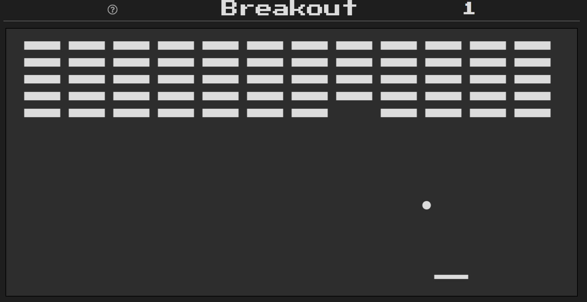

# Minesweeper

This is a breakout game made in vanilla HTML, CSS, JavaScript

## Game Instruction

OBJECTIVE: Using a single ball, the player must knock down as many bricks as possible by using the walls and/or the paddle below to hit the ball against the bricks and eliminate them.

CONTROLS: 

- [ARROW LEFT / A] - to move left. 
- [ARROW RIGHT / D] - to move right.
- Press any key to start.

## Screenshot

